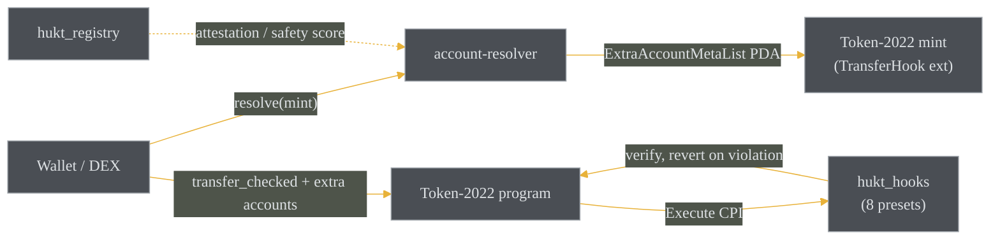

<div align="center">


# HUKT

**Solana Token-2022 Transfer Hook Framework.** Every transfer gets caught.

[](https://hukt.fun)
[](./docs)
[](https://x.com/huktfun)
[](https://github.com/hukt-labs/hukt/actions/workflows/ci.yml)
[](./LICENSE)
[](https://github.com/hukt-labs/hukt/stargazers)

[](https://www.anchor-lang.com)
[](https://explorer.solana.com/address/4q7Tgd9A1XfTB2i6WLUjmFXNocw6GrshZwcKgarGV9aC?cluster=devnet)
[](https://spl.solana.com/token-2022)
[](./anchor)
[](./sdk)

</div>

## Overview

HUKT is a framework for [Token-2022 transfer hooks](https://spl.solana.com/token-2022/extensions#transfer-hook)
on Solana. A transfer hook is a program that Token-2022 CPIs into on every
transfer of an adopting mint, letting the mint enforce rules that a plain SPL
token cannot. HUKT ships a program of eight composable, verified presets, the
offchain resolver that makes hook-enabled tokens usable by any wallet or DEX,
and an on-chain registry that lets integrators judge whether a hook is safe to
trust.

The organizing metaphor is a railway classification yard: every wagon is pushed
over the hump and caught by a coupler before it is allowed to join a train. Every
token transfer is pushed through the hook before it is allowed to settle.

## The problem

Token-2022's transfer-hook extension is powerful but awkward to adopt:

- **Extra accounts.** A hook can require additional accounts on every transfer.
  The exact set is encoded in an on-chain `ExtraAccountMetaList` TLV that a
  sender must read, decode, and resolve against live chain state. Wallets and
  DEXs that do not do this simply fail to transfer the token.
- **Correctness is subtle.** The account list the program writes and the accounts
  the handler reads must agree exactly; per-owner PDAs must be derived from the
  token account's stored owner, not from caller input; and a hook must reject
  invocations that are not part of a real transfer.
- **Trust.** A transfer hook sits in the path of every transfer. An integrator
  has no easy way to tell a benign hook from one that can freeze funds.

## The solution

| Layer | What it does |
| --- | --- |
| `anchor/programs/hukt_hooks` | Eight composable presets behind one Execute entrypoint, driven by a per-mint config mask. |
| `anchor/programs/hukt_registry` | Bonded attestation market: register a hook, post a Safe/Unsafe verdict with a bond, slash false attestors. |
| `sdk/account-resolver` | Reads a mint's `ExtraAccountMetaList` and reconstructs the exact ordered extra accounts a transfer needs. |
| `sdk/composability-adapter` | Appends those resolved accounts to an existing DEX/lending instruction. |
| `sdk/hook-builder` | Composes presets into a deployment spec and simulates the outcome with no chain access. |
| `sdk/resolver`, `sdk/cli` | One-line `hukt.resolve(mint)` and a `hukt` command-line tool. |
| `libs/*` | Shared Rust taxonomy and the malicious-pattern scoring attestors apply. |

A transfer hook is **verification-only**: it can revert a transfer but has no
authority to move, mint, or burn tokens. The Royalty and FeeOnTransfer presets
therefore *verify* a condition (a royalty receipt covers the amount; a fee policy
is satisfied) while the value movement is performed by an approved
marketplace/escrow or by the Token-2022 `TransferFee` extension. The framework
never claims otherwise.

## Architecture



On every transfer, Token-2022 passes five accounts (source, mint, destination,
authority, validation PDA) and then appends the resolved extra accounts. The
`HookConfig` PDA is always the first extra account, so the handler reads the
active preset mask before it walks the rest. See [`docs/architecture.md`](./docs/architecture.md)
and [`docs/hook-spec.md`](./docs/hook-spec.md) for the account order,
discriminators, and PDA seeds.

## Hook presets

Eight presets compose on a single mint via a bitmask. Each contributes its own
extra accounts and its own distinct revert reason.

| Preset | Enforces | Verify-only note |
| --- | --- | --- |
| Royalty | A royalty receipt covers `amount * bps / 10000` | Value moved by marketplace/escrow |
| Whitelist | Destination owner is on the allow list | |
| Blacklist | Source owner is not blocked | |
| Vesting | `now >= unlock timestamp` | |
| AntiBot | Per-wallet cooldown and per-transfer limit | Updates its own state PDA |
| KYCGate | A valid, unrevoked, unexpired attestation | Gatekeeper may be a third party |
| FeeOnTransfer | Fee policy satisfied; records owed fee | Fee withheld by Token-2022 `TransferFee` |
| Soulbound | Transfer only via an allowed exception | |

## Quick start

Add the presets you want to a mint's hook. The program is built on Anchor 0.31
against the SPL transfer-hook interface:

```toml
[dependencies]
anchor-lang = { version = "0.31.1", features = ["init-if-needed", "interface-instructions"] }
anchor-spl  = { version = "0.31.1", features = ["token_2022", "token_2022_extensions"] }
spl-transfer-hook-interface = "0.10.0"
spl-tlv-account-resolution  = "0.10.0"
```

The Execute entrypoint is mapped onto the SPL discriminator and walks the active
presets, consuming the extra accounts in the exact order they were declared:

```rust
#[interface(spl_transfer_hook_interface::execute)]
pub fn transfer_hook(ctx: Context<TransferHook>, amount: u64) -> Result<()> {
    hooks::run_transfer_hook(
        ctx.program_id,
        &ctx.accounts.source_token.to_account_info(),
        amount,
        &ctx.accounts.hook_config,
        ctx.remaining_accounts,
    )
}
```

Offchain, resolve the extra accounts a transfer needs before you build it:

```ts
import { Connection, PublicKey } from "@solana/web3.js";
import { resolveHook } from "@hukt/account-resolver";

const connection = new Connection("https://api.mainnet-beta.solana.com");
const mint = new PublicKey("<token-2022 mint>");

const { hookProgramId, extraAccounts } = await resolveHook(connection, mint, {
  transfer: { source, destination, authority, amount: 1_000_000n },
});
// Append `extraAccounts` to your transfer instruction's keys, in order.
```

## Deployments

Both programs are deployed to devnet: `hukt_hooks` as the reference/demo hook
and `hukt_registry` as its attestation registry.

| Program | Cluster | Program ID |
| --- | --- | --- |
| `hukt_hooks` | devnet | [`4q7Tgd9A1XfTB2i6WLUjmFXNocw6GrshZwcKgarGV9aC`](https://explorer.solana.com/address/4q7Tgd9A1XfTB2i6WLUjmFXNocw6GrshZwcKgarGV9aC?cluster=devnet) |
| `hukt_registry` | devnet | [`HkTcGxnRqmyBqrmMb63cad7sfJjzUo5jY4Y3ErQWBrGv`](https://explorer.solana.com/address/HkTcGxnRqmyBqrmMb63cad7sfJjzUo5jY4Y3ErQWBrGv?cluster=devnet) |

Both are devnet reference deployments. No build or test step sends a mainnet or
devnet transaction; a mainnet deployment happens only under an explicit,
user-provided deploy keypair.

## Repository layout

```
anchor/
  programs/hukt_hooks/       8-preset transfer hook program (Anchor 0.31)
  programs/hukt_registry/    bonded attestation + slashing registry
  tests/                     localnet integration tests (per preset + composed)
libs/
  hook-library/              shared preset taxonomy + parameter math (Rust)
  hook-registry/             malicious-pattern risk scoring types (Rust)
sdk/
  account-resolver/          ExtraAccountMetaList resolution (@hukt/account-resolver)
  composability-adapter/     append resolved extras to an instruction
  hook-builder/              compose presets -> spec, simulate, preview
  resolver/                  @hukt/resolver one-line integration
  cli/                       hukt-cli
idl/                         exported program IDLs
docs/                        architecture, hook spec, security
examples/                    runnable, chain-free SDK examples
```

A worked, chain-free example lives in [`examples/simulate-presets.ts`](./examples/simulate-presets.ts):
it composes four presets into one spec, previews the extra accounts each transfer
must carry, and simulates which transfer scenarios revert and why.

## Build and test

```bash
# On-chain programs (Solana toolchain + Anchor 0.31.1)
cd anchor && anchor build && anchor test

# Shared Rust libraries
cargo test --manifest-path libs/hook-library/Cargo.toml
cargo test --manifest-path libs/hook-registry/Cargo.toml

# TypeScript SDK
cd sdk && npm install
npm run typecheck --workspaces --if-present
npm test --workspaces --if-present
```

## References

- [SPL Token-2022 Transfer Hook interface](https://spl.solana.com/token-2022/extensions#transfer-hook)
- [`spl-transfer-hook-interface`](https://docs.rs/spl-transfer-hook-interface) and [`spl-tlv-account-resolution`](https://docs.rs/spl-tlv-account-resolution)
- [Anchor](https://www.anchor-lang.com) `interface-instructions`
- ERC-1363 / ERC-777 callback-token patterns, and Metaplex programmable-NFT royalty enforcement, as prior art for transfer-time policy

## License

[MIT](./LICENSE) &copy; hukt-labs
