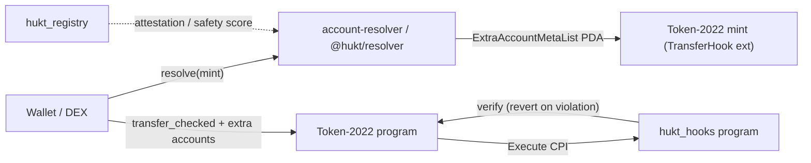
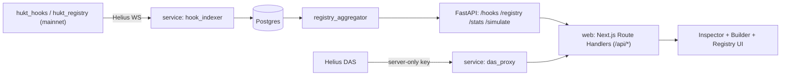

# Architecture

HUKT is a monorepo that implements the Solana Token-2022 transfer-hook standard
end to end: an on-chain Anchor program suite, an offchain resolver/SDK layer, an
indexer service, and a web inspector/builder. The organizing idea is the
classification yard -- every token transfer is pushed over the hump and caught
by a hook before it is allowed to couple.

## Monorepo layout

```
packages/
  anchor-program/        on-chain: hukt_hooks (8 presets) + hukt_registry
  hook-library/          shared Rust taxonomy + attestation scoring types
  hook-registry/         shared Rust registry/risk types
  account-resolver/      offchain ExtraAccountMetaList resolution (@hukt/account-resolver)
  composability-adapter/ appends resolved extras to a DEX/lending instruction
  hook-builder/          compose presets -> spec, simulate, preview accounts
  sdk-ts/                @hukt/resolver one-line integration
  cli/                   hukt-cli
service/                 FastAPI indexer + registry API + Helius DAS proxy
web/                     Next.js inspector + builder (Route Handler proxies)
```

## The core transfer path: wallet -> resolver -> hook -> registry

A transfer of a hook-enabled mint flows through four layers:



1. **Resolve.** Before building a transfer, an integrator calls
   `resolveExtraAccounts(...)` (or `hukt.resolve(mint)`). The resolver reads the
   mint's TransferHook extension to find the hook program, derives the
   `[b"extra-account-metas", mint]` validation PDA, decodes its TLV, and
   reconstructs the exact ordered extra accounts -- resolving PDA/`AccountData`
   seeds against live chain state. Wallets get a valid transfer with no bespoke
   wiring; this is the offchain technical heart.
2. **Transfer.** Token-2022 runs `transfer_checked` and, because the mint
   carries the TransferHook extension, CPIs into the hook program's `Execute`
   entrypoint with the resolved accounts appended.
3. **Hook (verify-only).** `hukt_hooks::transfer_hook` (mapped to the SPL
   Execute discriminator via `#[interface]`) reads the per-mint `HookConfig`
   and validates every active preset. A hook can only revert; it never moves
   tokens. Value-moving policies (Royalty, FeeOnTransfer) verify a receipt or
   accounting condition that a marketplace/escrow or the Token-2022 TransferFee
   extension actually settles.
4. **Registry.** `hukt_registry` records a deployed hook program, its preset,
   and its bonded safety attestations, keyed by the hook program's id. The
   resolver/SDK and the web inspector surface `attested` / `safetyScore` so
   integrators can judge a hook before trusting it.

## On-chain: hukt_hooks

- **`HookConfig` PDA** (`[b"hook-config", mint]`) stores a `presets_mask`
  bitmask over the eight presets plus shared parameters (cooldown, per-wallet
  limit, gatekeeper). It is always extra account index 5, so the handler learns
  which checks to run without a separate lookup.
- **`initialize_extra_account_meta_list` / `update_extra_account_meta_list`**
  write the `ExtraAccountMetaList` TLV built from the config. `meta::meta_count`
  sizes the PDA from the mask alone, and `build_extra_metas` produces the same
  ordered list the handler consumes in lockstep -- the two must agree.
- **Execute account order:** `0` source, `1` mint, `2` destination,
  `3` authority, `4` validation PDA, `5` HookConfig, `6..` preset accounts.
- **Eight presets:** Royalty, Whitelist, Blacklist, Vesting, AntiBot, KYCGate,
  FeeOnTransfer, Soulbound -- composable via the mask, each contributing its
  extra accounts and validation (see `docs/hook-spec.md` section 8 and
  `docs/security.md`).

## On-chain: hukt_registry

Register a hook (`register_hook`), post a bonded Safe/Unsafe/NeedsReview verdict
(`attest_hook`), seize a false attestor's bond (`slash_attestor`), and mark a
malicious hook (`revoke_hook`). Seeds: `[b"hook-registry", program_id]` and
`[b"attestation", program_id, attestor]`. The economics and threat model are in
`docs/security.md`.

## The inspection path: chain -> indexer -> web



- **`hook_indexer`** subscribes to Helius WebSocket for the two program ids,
  parses Execute CPIs (discriminator `692565c54bfb661a`) into `hook_executions`
  rows. It starts idle and no-ops when Helius is unset, so the service always
  boots.
- **`registry_aggregator`** turns `hook_deployments` / `attestations` rows into
  per-program snapshots (safety score, counts).
- **FastAPI** exposes `GET /hooks/{mint}`, `GET /registry`,
  `GET /registry/{programId}`, `GET /stats`, `POST /simulate`, and
  `GET /das/asset/{mint}` -- all camelCase, amounts as strings, with graceful
  empty responses when unindexed. `/simulate` is deterministic and needs no
  chain, so the Builder previews a preset combination's accounts and verdict
  before any deployment.
- The **web app** never calls the backend or a keyed RPC from the client. Its
  Next.js Route Handlers (`/api/das/*`, `/api/simulate`, `/api/stats`) proxy the
  FastAPI service server-side (same-origin), keeping the Helius key off the
  client.

## Program ids and clusters

Program ids are assigned by the deploy keypair. Local tests use throwaway
keypairs generated by `anchor build` (kept in sync via `anchor keys sync`).
Mainnet ids are produced only in the deployment phase, under an explicit
user-approved deploy keypair, and then populate `NEXT_PUBLIC_2_PROGRAM_ID`. No
mainnet or devnet transaction is sent from any build or test step.
